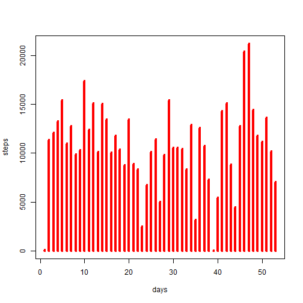
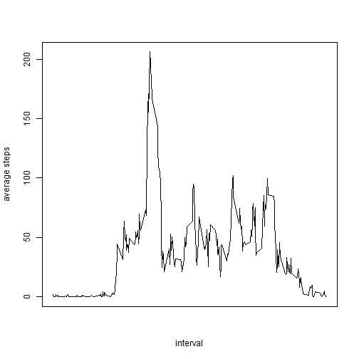

# Reproducible Research: Peer Assessment 1


## Loading and preprocessing the data

```r
data<-read.csv("activity.csv")
#deleting NA for preprocessing
data_preprocess<-data[complete.cases(data$steps),]
```


## What is mean total number of steps taken per day?

```r
hist(data_preprocess$steps)
```

 

```r
mean_steps<-mean(data_preprocess$steps)
median_steps<-median(data_preprocess$steps)
```
### The mean is 37.3826 and median is 0.

## What is the average daily activity pattern?

```r
average_activity<-tapply(data_preprocess$steps,data_preprocess$interval,mean,simplify=FALSE);
plot(names(average_activity),average_activity,type="l");
```

 
### The maximum number of steps is with interval of 835

## Imputing missing values

```r
ip_missing<-nrow(data)-sum(complete.cases(data))
```
### The number of missing values are 2304.


## Are there differences in activity patterns between weekdays and weekends?
