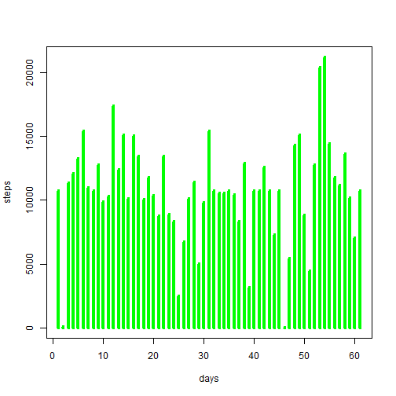
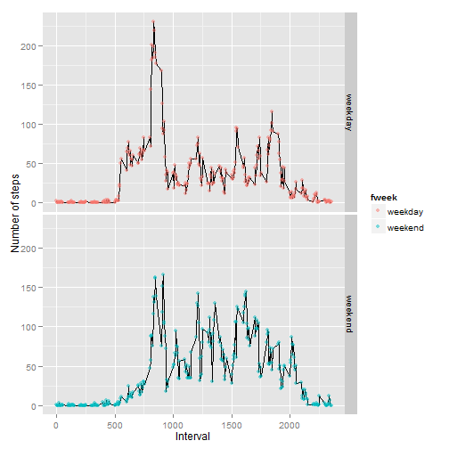

# Reproducible Research: Peer Assessment 1


## Loading and preprocessing the data

```r
data<-read.csv("activity.csv", colClasses = c("numeric", "Date", "numeric"))
#deleting NA for preprocessing
data_preprocess<-data[complete.cases(data$steps),]
```


## What is mean total number of steps taken per day?

```r
total<-tapply(data_preprocess$steps,data_preprocess$date,sum);
plot(1:length(total),as.vector(total),type="h",col = "red", lwd = 4,xlab="days",ylab="steps");
```

 

```r
mean_steps<-mean(as.vector(total))
median_steps<-median(as.vector(total))
```
### The mean is 1.0766 &times; 10<sup>4</sup> and median is 1.0765 &times; 10<sup>4</sup>.

## What is the average daily activity pattern?

```r
average_activity<-tapply(data_preprocess$steps,data_preprocess$interval,mean,simplify=FALSE);
plot(names(average_activity),average_activity,type="l",xaxt = "n",xlab="interval",ylab="average steps");
```

 
### The maximum number of steps is with interval of 835

## Imputing missing values

```r
ip_missing<-nrow(data)-sum(complete.cases(data))
data_without_NA<-data
#replace NA's with 0.
data_without_NA[!complete.cases(data_without_NA$steps),1]<-0;
total<-tapply(data_without_NA$steps,data_without_NA$date,sum);
plot(1:length(total),as.vector(total),type="h",col = "green", lwd = 4,xlab="days",ylab="steps");
```

 

```r
mean_steps<-mean(as.vector(total))
median_steps<-median(as.vector(total))
```
### The number of missing values are 2304.
### The new mean is 9354.2295 and median is 1.0395 &times; 10<sup>4</sup>.
### Few points to note 
* The mean and median changed i.e. decreased as of no NA's.
* Days in the histogram have increased because of no NA's.

## Are there differences in activity patterns between weekdays and weekends?

```r
library(ggplot2)
```

```
## Warning: package 'ggplot2' was built under R version 3.0.3
```

```r
index<-grepl("Sunday",weekdays(data_without_NA$date),ignore.case=TRUE) | grepl("Saturday",weekdays(data_without_NA$date),ignore.case=TRUE);
fweek = factor(index,labels=c("weekday","weekend"));
datawithweek<-cbind(data_without_NA,fweek);

X<-aggregate(x = datawithweek[,1], by = list(datawithweek$interval,datawithweek$fweek), FUN = "mean");
names(X)<-c("interval","fweek","steps")
g<-ggplot(X,aes(interval,  steps))+geom_line()
g<-g+geom_point(aes(color = fweek),size = 2, alpha = 1/2)
g<-g+facet_grid(fweek~.) 
g<-g+labs(x = "Interval", y = "Number of steps") 
print(g)
```

 
